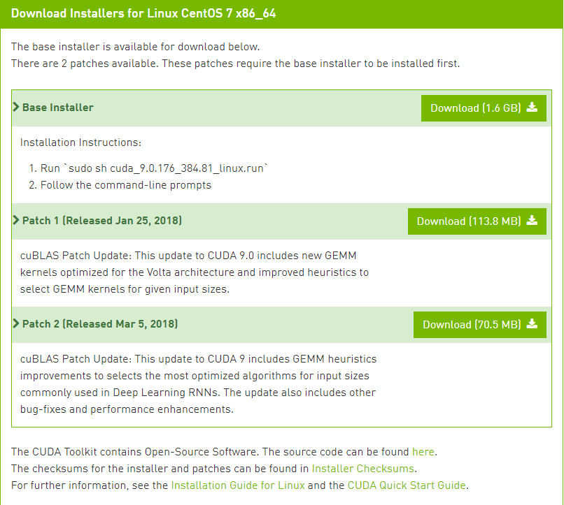
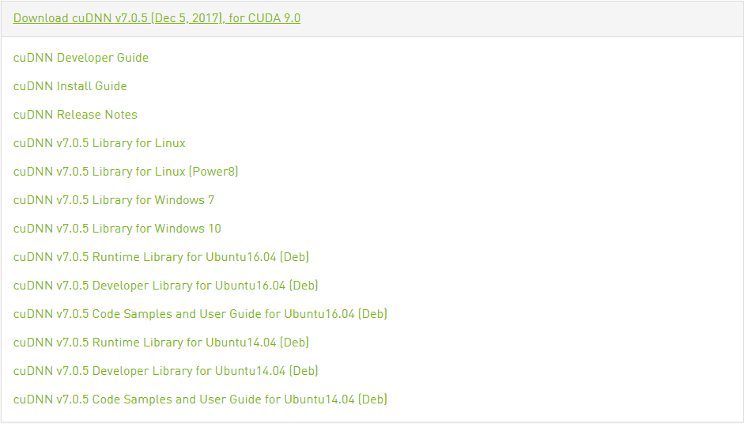

# Installation
The ADDL project are based on Bash, R and Python programming lauanguage. The local algorithm and interface develop in Python. Plenty of third party tools are involved in this project, the Bash, R and Python work as script language. The project only support Linux. And the CentOS7 is our working operation system(OS).

The installation is very easy, just copy source, but the third party tools setting up cost a lot. The project pends on two types of tool set, the neuroimaging processing tool set and deep learning(DL) tool set. Considering the complex dependency of software versions, OS and hardware, this section introduces a full setup process to setup all the required tools based on the CentOS7 minimal installed.

***The 3rd Party Tools Structure***<br>
* Deep learning tool set
  * GPU venders provided tools
    * Driver
    * CUDA
    * cuDNN
  * Deep learning framework
    * Anaconda
    * TensorFlow
    * TFLearn
* Neuroimaging processing tool set
  * FSL
  * ANTsR
  * Nibabel
  * OpenCV

# Deep Learning Tool Set
Currently, GPU is the most commen computation accelarator for DL algorithm. The DL tool set is typically devided into two suits, hardward vender provided tool and deep learning framework. The hardware vender provied tools contains driver interface of device and OS; CUDA the general GPU computation framework; cuDNN the DL algorithm optimization library. The DL framework connects developer and hardware, it help develper achieve DL application easily and fast, at the same time making the hardward work efficiently. There are lots of DL frameworks such as TensorFlow, Caffe2, PyTorch, etc. This project is using TensorFlow the most commen one.

## Determain Versions
There are native dependency and lantency between hardward vender provide tool and DL framework, so the latest version of DL framwork is a bit older then the latest version of hardware vender provided tools. One should take care of the versons of DL tools. Building a local version of DL framework pends on your local hardware vender provided tool for the edge features is out of scope of this document.

The TensorFlow official provides detail requiments, please check [here](https://www.tensorflow.org/install/install_linux#NVIDIARequirements). Till this document, the TensorFlow version is [1.6](https://github.com/tensorflow/tensorflow/releases/tag/v1.6.0), and the GPU requirement are shown below.
* CUDA = 9.0
* cuDNN = 7.0

Note the CUDA and cuDNN should be exactly match.

## GPU Venders Provided Tools

### Driver
Select the suitable driver base on your OS and GPU device from the NVIDIA driver download address(https://www.nvidia.com/drivers). The example GPU is GeForce GTX 1080. Specially, the native GPU driver of CentOS is Noveau, which is a third party open source driver for NVDIA cards, but poor support for the DL computation, so we need remove it before install the formal one. The following steps show the download and install detal process.

**Download**<br>
1. Manually find the drivers at [link](https://www.nvidia.com/drivers). Select the matching fields from the drop box listed below; click the "SEARCH" button.<br><br>
   
   <br><br>
2. Click the "DOWNLOAD" button at the search result page.
3. Click the "AGREE & DOWNLOAD" button downloading directly at the download confirmation page, or right click it for the download link.

Downloaded package is `NVIDIA-Linux-x86_64-390.25.run`.

**Remove Noveau Driver Command**<br>
```bash
# Check nouveau driver is installed.
lsmod | grep nouveau

# Disable nouveau driver.
touch /etc/modprobe.d/blacklist-nouveau.conf
echo "blacklist nouveau
options nouveau modeset=0" > /etc/modprobe.d/blacklist-nouveau.conf
mv /boot/initramfs-$(uname -r).img /boot/initramfs-$(uname -r).img.bak
dracut -v /boot/initramfs-$(uname -r).img $(uname -r)
reboot
```

**Install NVDIA Driver Command**<br>
```bash
# Check nvida driver is installed.
lsmod | grep nvidia

# Install nvida driver without interaction.
bash NVIDIA-Linux-x86_64-390.25.run --silent
```

### CUDA
Select the suitable CUDA version base on TenorFlow requiment, and select the suitable package base on the OS. The following steps show the download and install detail process.

**Download**<br>
1. Manually find the CUDA 9.0 from the [archive page](https://developer.nvidia.com/cuda-toolkit-archive),
2. Select the matching fields of the check box from the CUDA download page listed below.<br><br>

   <br><br>
3. The CUDA and patch packages listed below, the download link is at the "Download" button.<br><br>

   <br><br>

Downloaed Packages
* `cuda_9.0.176_384.81_linux.run`
* `cuda_9.0.176.1_linux.run`
* `cuda_9.0.176.2_linux.run`

**Install CUDA Command**<br>
```bash
bash cuda_9.0.176_384.81_linux.run --silent
bash cuda_9.0.176.1_linux.run --silent --installdir=/usr/local/cuda --accept-eula
bash cuda_9.0.176.2_linux.run --silent --installdir=/usr/local/cuda --accept-eula
```

### cuDNN
cuDNN download and inatllation detail process.

**Download**<br>
1. Download cuDNN needs register as a NVIDIA Developer. Click "Join" button of the NVIDA developer [main page](https://developer.nvidia.com/) to finished the register process.
2. Goto the cuDNN [download page](https://developer.nvidia.com/rdp/cudnn-download), and enable the check box of "cuDNN software license agreement".
3. Select the cuDNN v7.0.5 for CUDA 9.0 as the TensorFlow requirement, and get the dropdown selections.<br><br>
   
   <br><br>
4. Get the download link of the cuDNN package from the "cuDNN v7.0.5 Library for Linux" selection.

Downloaded package is `cudnn-9.0-linux-x64-v7.solitairetheme8`.

**Install cuDNN Command**<br>
```bash
# Rename the downloaded cuDNN package.
mv cudnn-9.0-linux-x64-v7.solitairetheme8 cudnn-9.0-linux-x64-v7.tgz

# Install with unpackaging the cuDNN package.
tar xzvf cudnn-9.0-linux-x64-v7.tgz -C /usr/local
```

## Deep Learning Framework

### Anaconda
Anaconda is a freemium open source distribution of the Python and R programming languages for large-scale data processing, predictive analytics, and scientific computing, that aims to simplify package management and deployment. Package versions are managed by the package management system conda.

The project using Anaconda Python environment instead of CentOS7 native python environment, And Anaconda Python2.7 is installed at a normal user account named python2.

**Download**<br>
Select a latest Anaconda2 package base on the OS from the archive [url](https://repo.continuum.io/archive/).

Downed package is `Anaconda2-5.1.0-Linux-x86_64.sh`.

**Install Anaconda Command**<br>
```bash
# Install Anaconda at python2 account.
bash Anaconda2-5.1.0-Linux-x86_64.sh -b

# Assign Anaconda executions the first priority.
echo "export PATH=\"$HOME/anaconda2/bin:\$PATH\"" >> $HOME/.bashrc

# Add nearest conda mirror.
conda config --add channels https://mirrors.tuna.tsinghua.edu.cn/anaconda/pkgs/free/
conda config --add channels https://mirrors.tuna.tsinghua.edu.cn/anaconda/pkgs/main/
conda config --set show_channel_urls yes
```

### TensorFlow
TensorFlow™ is an open source software library for high performance numerical computation. Its flexible architecture allows easy deployment of computation across a variety of platforms (CPUs, GPUs, TPUs), and from desktops to clusters of servers to mobile and edge devices. Originally developed by researchers and engineers from the Google Brain team within Google’s AI organization, it comes with strong support for machine learning and deep learning and the flexible numerical computation core is used across many other scientific domains.

**Download**<br>
Please check the download [url](https://www.tensorflow.org/install/install_linux#the_url_of_the_tensorflow_python_package), and select "Python2.7" and "GPU support" package address(https://storage.googleapis.com/tensorflow/linux/gpu/tensorflow_gpu-1.6.0-cp27-none-linux_x86_64.whl).

**Install TensorFlow Command**<br>
```bash
# The installation process contains some dependency package installation.
# If your pip downloading slowly, please change the PyPI mirror.
pip install tensorflow_gpu-1.6.0-cp27-none-linux_x86_64.whl

# Assign CUDA environment variables suits for TensorFlow GPU.
echo "export PATH=\"/usr/local/cuda/bin:\$PATH\"" >> $HOME/.bashrc
echo "export LD_LIBRARY_PATH=\"/usr/local/cuda/lib64:\$LD_LIBRARY_PATH\"" >> $HOME/.bashrc
echo "export CUDA_HOME=\"/usr/local/cuda\"" >> $HOME/.bashrc
```

### TFLearn
TFlearn is a modular and transparent deep learning library built on top of Tensorflow. It was designed to provide a higher-level API to TensorFlow in order to facilitate and speed-up experimentations, while remaining fully transparent and compatible with it. The PyPI/pip support TFLearn package installation.

**Install TFLearn Command**<br>
```bash
pip install tflearn
```

#### PyPI Mirrors
Please use your prefer PyPI mirror. For example setting mirror https://pypi.tuna.tsinghua.edu.cn/simple as the default PyPI mirror.

**Temporary Usage**<br>
```bash
pip install -i https://pypi.tuna.tsinghua.edu.cn/simple some-package
```

**Default Setting**<br>
Fill the following context to file `~/.config/pip/pip.conf`.
```
[global]
index-url = https://pypi.tuna.tsinghua.edu.cn/simple
```

----

# Neuroimaging Processing Tool Set
The rapid progress of research in the neuroscience and neuroimaging fields has been accompanied by the development of many excellent analysis software tools. These are implemented in a variety of computer languages and programming environments.

----

## FSL
FSL is a comprehensive library of analysis tools for FMRI, MRI and DTI brain imaging data. It runs on Apple and PCs (both Linux, and Windows via a Virtual Machine), and is very easy to install. Most of the tools can be run both from the command line and as GUIs ("point-and-click" graphical user interfaces). To quote the relevant references for FSL tools you should look in the individual tools' manual pages.

**Download**<br>

**Install FSL Command**<br>
```bash
python fslinstaller.py -f fsl-5.0.10-centos7_64.tar.gz -M -d /usr/local/fsl -q
```

----

## ANTsR

R is a freely available language and environment for statistical computing and graphics which provides a wide variety of statistical and graphical techniques: linear and nonlinear modelling, statistical tests, time series analysis, classification, clustering, etc.

ITK is an open-source software toolkit for performing registration and segmentation. Segmentation is the process of identifying and classifying data found in a digitally sampled representation. Typically, the sampled representation is an image acquired from such medical instrumentation as CT, MRI or ultrasound scanners. Registration is the task of aligning or developing correspondences between data. For example, in the medical environment, a CT scan may be aligned with a MRI scan in order to combine the information contained in both.
ITKR provides R-based access to the Insight ToolKit (ITK) for medical image processing, registration and segmentation.

The ANTS framework provides open-source functionality for deformable normalization with large deformations. Small deformation mappings and segmentation tools are also available.  Developer evaluation showed stronger differences with other methodology in neurodegenerative neuroimaging data, where large deformation is required. ANTs serves as both a base for further algorithm development and also as an application-oriented toolkit. ANTS enable diffeomorphic normalization with a variety of transformation models, optimal template construction, multiple types of diffeomorphisms, multivariate similarity metrics, diffusion tensor processing and warping, image segmentation with and without priors and measurement of cortical thickness from probabilistic segmentations. The normalization tools, alone, provide a near limitless range of functionality and allow the user to develop customized objective functions. Objective functions in ANTS are of the form:Deformation Cost+Data Terms, and the command line reflects this balance of two terms. As mentioned above, the data term may combine multiple different measures of similarity that are optimized in parallel, for instance, image similarity and landmark terms.

A package providing core features for ANTsR.

A package providing ANTs features in R as well as imaging-specific data representations, spatially regularized dimensionality reduction and segmentation tools。
ANTsR interfaces state of the art image processing with R statistical methods. The project grew out of the need, at University of Pennsylvania, to develop large-scale analytics pipelines that track provenance from scanner to scientific study. ANTsR wraps an ANTs and ITK C++ core via Rcpp to access these frameworks from within R and support reproducible analyses. Specialized functionality in ANTsR includes image segmentation and registration along imaging specific variations of principal component and canonical correlation analysis.
A package providing ANTs features in R as well as imaging-specific data representations, spatially regularized dimensionality reduction and segmentation tools.

Extends the ANTsR package with simple wrappers and complex processing streams for neuroimaging data.

**Install ANTsR Command**<br>
```bash
# Install R
yum install -y epel-release
yum install -y R

# Install pending packages, using the specify CRAN mirror.
# Source build process.
install.package("optparse",    repos="https://mirrors.ustc.edu.cn/CRAN", dependencies=TRUE)
install.package("bitops",      repos="https://mirrors.ustc.edu.cn/CRAN", dependencies=TRUE)
install.package("abind",       repos="https://mirrors.ustc.edu.cn/CRAN", dependencies=TRUE)
install.package("neurobase",   repos="https://mirrors.ustc.edu.cn/CRAN", dependencies=TRUE)
install.package("matrixStats", repos="https://mirrors.ustc.edu.cn/CRAN", dependencies=TRUE)
install.package("R.utils",     repos="https://mirrors.ustc.edu.cn/CRAN", dependencies=TRUE)
install.package("rgl",         repos="https://mirrors.ustc.edu.cn/CRAN", dependencies=TRUE)
install.package("R.matlab",    repos="https://mirrors.ustc.edu.cn/CRAN", dependencies=TRUE)
install.package("neuroim",     repos="https://mirrors.ustc.edu.cn/CRAN", dependencies=TRUE)
install.package("magic",       repos="https://mirrors.ustc.edu.cn/CRAN", dependencies=TRUE)
install.package("psych",       repos="https://mirrors.ustc.edu.cn/CRAN", dependencies=TRUE)
install.package("rsvd",        repos="https://mirrors.ustc.edu.cn/CRAN", dependencies=TRUE)
install.package("RcppEigen",   repos="https://mirrors.ustc.edu.cn/CRAN", dependencies=TRUE)
install.package("WhiteStripe", repos="https://mirrors.ustc.edu.cn/CRAN", dependencies=TRUE)
install.package("fslr",        repos="https://mirrors.ustc.edu.cn/CRAN", dependencies=TRUE)
install.package("oro.nifti",   repos="https://mirrors.ustc.edu.cn/CRAN", dependencies=TRUE)
install.package("devtools",    repos="https://mirrors.ustc.edu.cn/CRAN", dependencies=TRUE)

#R CMD INSTALL ITKR_0.4.12_R_x86_64-pc-linux-gnu.tar.gz
#R CMD INSTALL ANTsRCore_0.4.2.1_R_x86_64-pc-linux-gnu.tar.gz
#R CMD INSTALL ANTsR_0.6_R_x86_64-pc-linux-gnu.tar.gz

# Install extrantsr
devtools::install_github("muschellij2/extrantsr")
```

**Find CRAN Mirror Tips**<br>

----

## Nibabel

**Install nibabel Command**<br>
```bash
pip install nibabel
```

----

## OpenCV

**Install opencv-python Command**<br>
```bash
pip install opencv-python
```

----
