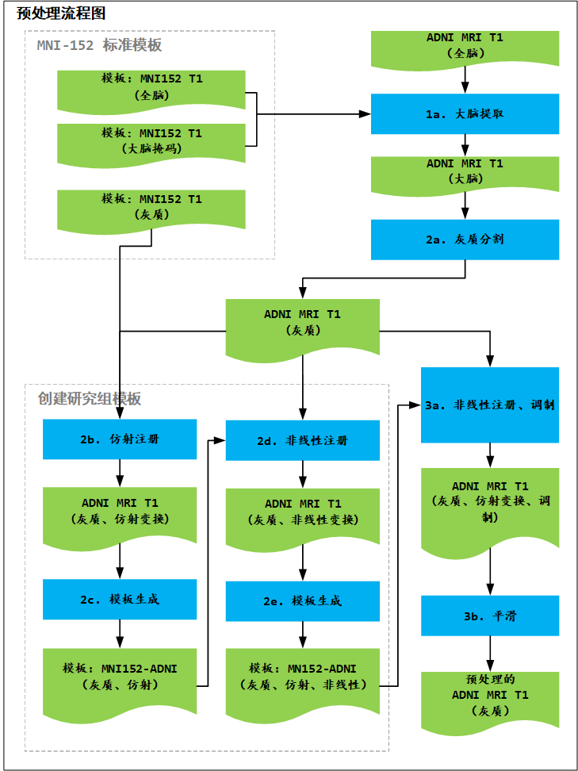
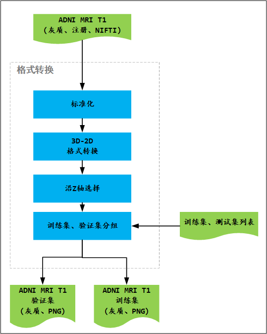

<a id="toc_content">**目录**</a>
1. [ADDL 简介](#toc1)
1. [预处理](#toc2)
   1. [大脑提取](#toc2.1)
   1. [灰质分割](#toc2.2)
   1. [创建模板](#toc2.3)
      1. [仿射注册](#toc2.3.1)
      1. [非线性注册](#toc2.3.2)
      1. [创建模板](#toc2.3.3)
   1. [非线性注册](#toc2.4)
   1. [调制](#toc2.5)
   1. [平滑](#toc2.6)
1. [格式转换](#toc3)
   1. [标准化](#toc3.1)
   1. [3D-2D 格式转换](#toc3.2)
   1. [沿Z轴选择](#toc3.3)
   1. [训练集和验证集分组](#toc3.4)
1. [二进制封装](#toc4)
1. [ResNet](#toc5)
1. [诊断算法](#toc6)
1. [参考文献](#toc7)

----
[
*返回目录*
](#toc_content)

# <a id="toc1">1. ADDL 简介</a>
ADDL项目基于ADNI中阿尔兹海默症和非阿尔兹海默症主体的结构核磁共振影像（T1， 2017）数据，利用ResNet深度学习模型学习经预处理过程得到的大脑灰质组织图片，利用诊断算法处理ResNet模型的推断结果，实现对阿尔兹海默症的诊断。

上面的图片显示了ADDL项目流程，它包含预处理、格式转换、训练和推理四个过程。预处理过程从ADNI核磁共振影像数据中分割提取灰质，并对研究组所有数据进行灰质注册。格式转换过程将图片由NIFTI格式转为PNG格式，并将所有图片分成训练集和验证集。训练过程将训练集图片和对应的标签打包成二进制文件，并将二进制文件输入到ResNet模型进行训练，当网络收敛时得到ResNet模型参数。推理过程将验证集图片按照被试主体打包为二进制文件，并将二进制文件传入给经过训练的ResNet模型，然后根据诊断算法得到阿尔兹海默症的诊断结果。

----
[
*返回目录*
](#toc_content)

# <a id="toc2">2. 预处理</a>
预处理过程从ADNI的核磁共振影像数据中分割提取灰质组织。我们使用[FSL-VBM](http://fsl.fmrib.ox.ac.uk/fsl/fslwiki/FSLVBM)做为预处理工具，并将其中一些部分替换成[ANTsR](https://github.com/ANTsX/ANTsR)。

>“FSL-VBM（Douaud等，2007年， http://fsl.fmrib.ox.ac.uk/fsl/fslwiki/FSLVBM）\[[1](#r1)\]分析结构核磁共振影像数据，这是一个使用FSL工具（Smith等， 2004年）\[[3](#r3)\]进行的优化的VBM协议（Good等，2001年）\[[2](#r2)\]。首先，对结构核磁共振影像数据进行脑部提取和灰质分割，然后使用非线性配准注册（Andersson等，2007年）\[[4](#r4)\]到MNI-152标准空间。将结果图像沿x轴翻转并平均以创建左右对称的研究组特异性灰质模板。其次，将所有原生空间的灰质图像非线性地注册到该研究组特异性灰质模板，并“调制”由于空间变换的非线性分量产生的局部扩展（或收缩）。调制的灰质图像然后用范围是某毫米的各向同性高斯核来平滑。最后，对体素的GLM使用基于置换的非参数测试，以纠正跨空间的多重比较。”
>
>
 —— 引用 FSL-VBM

上图显示FSL-VBM的流程细节。每一个过程的序号与预处理流程[源代码](../src/1.DataPreprocessing)文件的名字对应。

请参考[ADDL 基础](基础.md#toc3.6.2)文档以获得标准模板MNI-152的信息。本项目使用FSL软件包中的MNI-152模板。

----
[
*返回目录*
](#toc_content)

### <a id="toc2.1">2.1 大脑提取</a>
大脑提取过程从ADNI核磁共振的全脑数据中分割提取大脑组织数据，为了下一步中更好的灰质分割结果，这是一个必要的过程。

我们使用ANTsR软件包中的[`abpBrainExtraction`](https://www.rdocumentation.org/packages/ANTsR/versions/1.0/topics/abpBrainExtraction)做为大脑提取工具。由于ADNI标准核磁共振影像T1数据的预处理序列包含N3纠正，[`abpN4`](https://www.rdocumentation.org/packages/ANTsR/versions/1.0/topics/abpN4)没有被用于异常强度截断和顶部线圈偏移纠正。注意我们这里忽略了N3和N4的不同。

将MNI-152标准模板的大脑掩码参考各个ADNI核磁共振影像数据使用仿射和非线性空间变换（FMM）注册，然后利用大脑掩码提取大脑。

----
[
*返回目录*
](#toc_content)

### <a id="toc2.2">2.2 灰质分割</a>
大脑提取阶段之后即是灰质分割。灰质分割从ADNI受试者的脑部数据中分割提取灰质组织数据，这是后续灰质注册过程的起始点。

我们使用FSL软件包中的[`FAST`](https://fsl.fmrib.ox.ac.uk/fsl/fslwiki/FAST)\[[5](#r5)\]做为灰质分割工具。

>FAST（FMRIB的自动分割工具）将大脑的3D图像分割成不同的组织类型（灰质，白质，CSF等），同时还校正空间强度变化（也称为偏置场或RF不均匀性）。基础方法基于隐式马尔可夫随机场模型和相关的最大期望算法。整个过程是完全自动化的，并且还可以产生经偏置场校正的输入图像和基于概率的部分组织的分割。与大多数对噪声敏感的基于有限混合模型的方法相比，它是稳健可靠的。
>
>
——FAST研究概况

----
[
*返回目录*
](#toc_content)

### <a id="toc2.3">2.3 创建模板</a>
模板创建基于研究组中所有主体的灰质组织数据生成研究组特异的灰质模板，用于研究组灰质注册。它将研究组中所有主体的灰质数据仿射注册到MNI152标准空间，并获得一个名为MNI152-ADI仿射的模板。 然参考MNI152-ADNI仿射模板对所有研究组的灰质数据应用非线性注册，并获得用于后续灰质注册的模板。

----
[
*返回目录*
](#toc_content)

### <a id="toc2.3.1">2.3.1 仿射注册</a>
请参考[ADDL 基础](基础.md#toc3.3)以获取仿射注册的细节。

项目使用FSL软件包中的[`fsl_reg`](https://manned.org/fsl4.1-fsl_reg/baac7ea7)做为本阶段中的仿射注册工具。

----
[
*返回目录*
](#toc_content)

### <a id="toc2.3.2">2.3.2 非线性注册</a>
请参考[ADDL 基础](基础.md#toc3.3)以获取非线性注册的细节。

项目使用extrantsr软件包中的[`ants_regwrite`](https://rdrr.io/github/neuroconductor/extrantsr/man/ants_regwrite.html)做为本阶段的非线性注册工具。

----
[
*返回目录*
](#toc_content)

### <a id="toc2.3.3">2.3.3 模板生成</a>
模板生成用于合成研究组的模板，它包括平均和左右镜像操作。平均使得模板包含了所有的主体的数据信息，左右镜像是来自与大脑的左右对称性。

项目使用FSL软件包中的[`fslmerge`](https://www.rdocumentation.org/packages/fslr/versions/2.0/topics/fslmerge)、 [`fslmaths`](https://mandymejia.wordpress.com/fsl-maths-commands/)和[`fslswapdim`](https://www.rdocumentation.org/packages/fslr/versions/2.0/topics/fslswapdim) 做为模板生成工具。

----
[
*返回目录*
](#toc_content)

## <a id="toc2.4">2.4 非线性注册</a>
该非线性登记阶段参考[section 2.3](#toc2.3)中生成研究组特异性模板，对ADNI研究组中所有主体的灰质数据实施空间标准化注册。

本项目使用ANTsR软件包中的[`antsRegistration`](https://www.rdocumentation.org/packages/ANTsR/versions/1.0/topics/antsRegistration)做为本阶段的非线性注册工具。

----
[
*返回目录*
](#toc_content)

### <a id="toc2.5">2.5 调制</a>
由于非线性空间标准化，某些大脑区域的体积可能会增加，而其他区域可能会缩小。为了保持体素内特定组织（灰色或白质或CSF）的体积，引入进一步的处理步骤。这涉及将分割图像中的体素值乘以（或调制）由从空间标准化步骤导出的雅可比行列式。实际上，对调制数据的分析，测试了灰质绝对量（体积）的区域差异；而未调制数据的分析，测试了灰质浓度的区域差异（原生空间中的单位体积）（Ashburner和Friston，2000年）\[[6](#r6)\]。

本项目使用ANTsR软件包中的[`createJacobianDeterminantImage`](https://www.rdocumentation.org/packages/ANTsR/versions/1.0/topics/createJacobianDeterminantImage)做为本阶段的调制工具。

----
[
*返回目录*
](#toc_content)

## <a id="toc2.6">2.6 平滑</a>
使用3毫米FWHM各向同性高斯核对标准化的分割图像进行平滑。这使得数据更符合用于推断区域特定效应的统计过程的高斯场模型。平滑还具有使数据更加正态分布的效果（通过中心极限定理）。平滑数据的每个体素中的强度是来自周围体素区域的灰质密度的局部加权平均值，该区域的大小由平滑核心的大小定义（Ashburner和Friston，2000）\[[6](#r6)\]。

本项目使用FSL软件包中的[`fslmaths`](https://mandymejia.wordpress.com/fsl-maths-commands/)做为本阶段的平滑工具。

----
[
*Back to Content*
](#toc_content)

# <a id="toc3">3. 格式转换</a>
格式转换或NIFTI2PNG过程服务于深度学习模型。

----
[
*返回目录*
](#toc_content)

## <a id="toc3.1">3.1 标准化</a>
为了加快深度学习模型训练过程的收敛，项目引入标准化过程。标准化操作如下。

----
[
*返回目录*
](#toc_content)

## <a id="toc3.2">3.2 3D-2D 格式转换</a>
深度学习模型需要输入2D图像数据，所以本阶段将ADNI核磁共振影像图片从NIFTI变为PNG格式，即将3D图像数据沿着Z轴切割成多个2D图像。

我们使用[`nibabel`](http://nipy.org/nibabel/)做为格式转换工具。

----
[
*返回目录*
](#toc_content)

## <a id="toc3.3">3.3 沿Z轴选择</a>
在灰质分割和注册预处理过程之后，在影像数据的顶部和底部区域会有一些空白图片，我们删掉所有主体在Z轴上相同位置的空白图片。

----
[
*返回目录*
](#toc_content)

## <a id="toc3.4">3.4 训练集和测试集分组</a>
深度学习模型需要训练组和验证组数据。对于每个研究组，80％的阿尔兹海默症和非阿尔兹海默症的图像被选择用于训练，其余20％用于验证。一个主体，以及他或她的所有访问图像，只出现在训练或验证组中。

对于每个研究组，我们以列表的形式将数据手工地分为训练组和验证组，文档[ADDL 研究](研究.md)包含培训和验证组的详细信息。

----
[
*返回目录*
](#toc_content)

# <a id="toc4">4. 二进制封装</a>
二进制封装进一步服务于深度学习模型。本阶段根据深度学习模型调整图片的分辨率（32x32本项目）。它为深度学习训练过程封装训练组图片和对应标签，并为深度学习推理过程按被试主体封装验证组图片。由于深度学习模型形式上是Python脚本，二进制封装工具将封装好的数据转换成高效的Python对象二进制文件。

----
[
*返回目录*
](#toc_content)

## <a id="toc5">5. ResNet模型</a>
项目使用ResNet\[[7](#r7)\]做为深度学习模型。

项目使用[TFLearn](http://tflearn.org/)实现深度学习模型，ResNet模型参考[TFLearn 范例](https://github.com/tflearn/tflearn/blob/master/examples/images/residual_network_cifar10.py)，详细的实现过程请参考[源代码](../src/4.ModelTrainTest/residual_network_2classes.py)。

----
[
*返回目录*
](#toc_content)

## <a id="toc3.5">3.5 诊断算法</a>
ResNet模型推理过程的输出是沿Z轴图片的AD或NL的分类标签，一个主体的一个核磁共振三维影像数据包含大约
60个标签。诊断算法根据沿Z轴的图像的AD预测标签给出诊断结果。考虑到灰质位置或组织连接可能关联阿尔兹海默症的特征，为了更高的准确性，我们将每个标签矢量加权做为诊断量。关于诊断算法的详细信息，请参阅文档[ADDL 研究])(研究.md#诊断)。

----
[
*返回目录*
](#toc_content)

# <a id="toc7">7. Reference</a>
\[1\] <a id="r1">[Douaud G, Smith S, Jenkinson M, Behrens T, Johansen-Berg H, Vickers J, James S, Voets N, Watkins K, Matthews PM, James A, Anatomically related grey and white matter abnormalities in adolescent-onset schizophrenia,  Brain 130:2375-2386, 2007](http://users.fmrib.ox.ac.uk/~douaud/SCZ_X_vbm_tbss.pdf)</a> 
\[2\] <a id="r2">[Good CD, Johnsrude IS, Ashburner J, Henson RN, Friston KJ, Frackowiak RS, A voxel-based morphometric study of ageing in 465 normal adult human brains, NeuroImage 14:21-36, 2001](https://www.sciencedirect.com/science/article/pii/S1053811901907864)</a> 
\[3\] <a id="r3">[Smith SM, Jenkinson M, Woolrich MW, Beckmann CF, Behrens TE, Johansen-Berg H, Bannister PR, De Luca M, Drobnjak I, Flitney DE, Niazy RK, Saunders J, Vickers J, Zhang Y, De Stefano N, Brady JM, Matthews PM, Advances in functional and structural MR image analysis and implementation as FSL, NeuroImage 23 Suppl 1:S208-219, 2004](http://www.fmrib.ox.ac.uk/datasets/techrep/tr04ss2/tr04ss2.pdf)</a> 
\[4\] <a id="r4">[Andersson, M. Jenkinson and S. Smith, Non-linear registration, aka Spatial normalisation, FMRIB technical report TR07JA2 from www.fmrib.ox.ac.uk/analysis/techrep, 2007](http://www.fmrib.ox.ac.uk/datasets/techrep/tr07ja2/tr07ja2.pdf)</a> 
\[5\] <a id="r5">[Zhang, Y. and Brady, M. and Smith, S., Segmentation of brain MR images through a hidden Markov random field model and the expectation-maximization algorithm, IEEE Trans Med Imag, 20(1):45-57, 2001](http://www.csd.uwo.ca/~olga/Courses/Fall2014/CS9840/PossibleStudentPapers/Zhang2001.pdf)</a> 
\[6\] <a id="r6">[John Ashburner and Karl J. Friston, Voxel-Based Morphometry—The Methods, doi:10.1006/nimg.2000.0582, 2000](http://www.fil.ion.ucl.ac.uk/spm/doc/papers/john_vbm_methods.pdf)</a> 
\[7\] <a id="r7">[Kaiming He, Xiangyu Zhang, Shaoqing Ren, Jian Sun, Deep Residual Learning for Image Recognition, arXiv:1512.03385, 2015](https://arxiv.org/abs/1512.03385)</a> 
